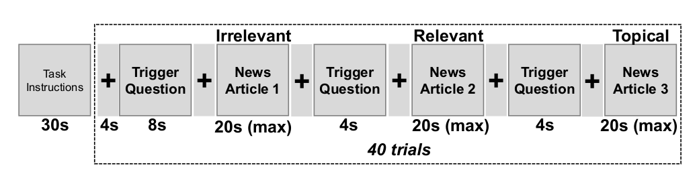
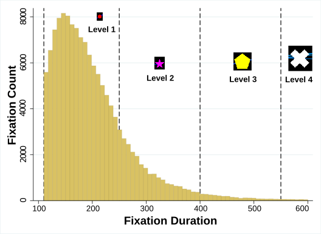
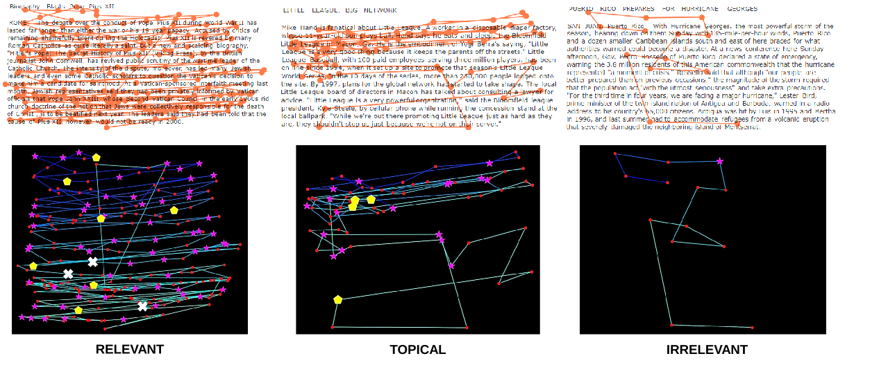

We propose an image-classification method to predict user's perceived-relevance from their eye-movement patterns. Our method is free from many of the inherent problems associated with analyzing eye-tracking data, as shown in existing literature. Specifically, we convert participant's eye-movement scanpaths into images, and then transform the relevance-prediction problem into an image-classification problem. For this purpose, we use state-of-the art image classifiers based on convolutional neural networks. Our method gives promising results, and outperforms many previously reported performances in similar studies by appreciable margins. We also attempt to interpret how the classifier possibly differentiates between user-reading-patterns on relevant and irrelevant documents. Finally, we discuss the limitations of our approach, and propose future directions of research.
{}
# User Study
## Experimental Design and Procedure
A controlled lab experiment was conducted in the Department of Kinesiology, University of Maryland, College Park. Participants ($N=25$, college-age students) judged the relevance of short news articles for answering a trigger question. Eye-tracking and EEG signals were recorded.

<figcaption>Experimental procedure. The &quot;+&quot; represents a fixation screen. The order of Relevant, Irrelevant and Topical articles were permuted in each trial</figcaption>

The main element of the experimental procedure was a trial. In each trial, a trigger question was shown first. The trigger questions was a short, one-sentence question, informing participants what to look for in the subsequently presented documents (e.g. &quot;What is the birth name of Jesse Ventura?&quot;). After the trigger question, a short news article was displayed, then a text relevance response (Y/N) screen appeared, then a list of words for further assessment was shown. Participants progressed between stimuli by pressing a space bar, with an exception of moving from a news article to the text-relevance response screen, which occurred by participants fixating their eyes for two seconds or longer in the lower-right screen-corner to indicate their readiness for relevance judgement. Finally, a fixation screen was shown for one second between trials. The list of words for further assessment are not analysed in this paper. The news articles were chosen to have three levels of relevance with respect to the trigger question:

1. **Relevant `(R)`**: the article explicitly contained the exact answer asked in the question.
2. **Topical `(T)`**: partially relevant – the article did not contain the exact answer to the question, but was on the topic of the information asked in the question.
3. **Irrelevant `(I)`**: did not contain the answer to the question

## Stimuli Dataset
The set of 40 trigger questions were selected from the `TREC 2005 Question Answering Task`. The collection of 120 short news articles and their document-relevance labels came from the `AQUAINT Corpus of English News Text` (the same collection used in `TREC 2005 Q\&A Task`. The news articles were carefully selected to have nearly similar text-length (`mean length`: 178 words, `SD`: 30 words.

# Data Analysis
## Generating Scanpath Images
We generated scanpath images from eye-tracking data of user-document pairs, using only three attributes of eye-fixations: screen-coordinates (in pixels), fixation duration (in ms), and start time of the fixation relative to stimulus-onset. We used Python Matplotlib library to generate the scanpath images. CNNs have been shown to be good at detecting local patterns within images. Since we were preparing the images for training a CNN classifier, we made the following design choices:
### Fixations
Eye-fixations were encoded as marker points having varying shapes, sizes, and colours. These were controlled by the fixation duration as follows:

1. 110 - 250 ms: Level 1 fixations, encoded as red circle
2. 250 - 400 ms: Level 2 fixations, encoded as pink star
3. 400 - 550 ms: Level 3 fixations, encoded as yellow pentagon
4. > 550 ms: Level 4 fixations, encoded as white cross

These levels were identified empirically. We examined the distribution of fixation durations in our data, and roughly divided the range into three equal partitions. Fixations having durations less than 110 ms were discarded. The marker-size was made to increase with the Level number. The fixation markers were chosen to be grossly different from each other (instead of, say, only circles), so that the CNN could possibly identify spatial patterns of similar-duration fixations.

<figcaption>Distribution of fixation-durations recorded in our study, and the corresponding encoding marker for representing fixations belonging to different levels, according to their duration</figcaption>

### Linearized Saccades
Saccades are rapid eye-movements between two fixation points. We controlled the colour of the saccade lines to follow a linear colour scale, based on their temporal occurrence [(&quot;Winter&quot; colourmap in Matplotlib)](https://matplotlib.org/3.1.1/gallery/color/colormap_reference.html)
The colour of the saccades changed linearly from blue (first saccade) to green (final saccade).
Each individual saccade had a solid colour.

We also tested controlling the width of the saccade lines using saccade velocity (ratio of screen-distance covered to time taken). However, doing so made the scanpath-image too crowded, especially for scanpaths having more than 50 fixations. So we kept the width of the saccade lines constant at 2 pixels.

### Colours
Care was taken to select the colours of the fixations and the saccades. Using a colour wheel, the colours of the different fixation markers were chosen to be far apart, from each other, as well as from the range of colours used to draw the saccades. We hypothesized that these colour choices would enable the CNN classifier to easily distinguish between fixations and saccades, and identify necessary patterns. Examples of typical eye-movement patterns on three types of documents, and their corresponding generated scanpath images are shown in Figure given below. 

<figcaption>Top: Typical eye-movement patterns when reading relevant, irrelevant, and topical documents. Bottom: Examples of generated scanpath images, which are used to train CNN classifiers for predicting the user’s perceived-relevance of the
documents.</figcaption>

## Machine Learning Setup
ata was available for 24 participants, where each participant judged the binary relevance of 120 news articles. In total we had eye-tracking data for 2,880 user-document pairs, or 2,880 scanpaths. After data cleaning, we decided to use scanpaths having 10 or more fixations. We assumed that at least 10 fixations, or a minimum eye dwell-time of 1 second on the document (at 100 ms / fixation) is required to make a relevance assessment. This left us with 2,579 scanpath images.

### Train / Validation / Test Partition
We used the participants' perceived-relevance labels as the ground-truth for our classification task (and not the document-relevance obtained from TREC dataset). Out of the 2,579 scanpath images, only 806 (31.2%) were for documents marked relevant. Thus, there was almost a 1:2 class imbalance. Since this is an initial attempt to apply image classification on scanpath images, we decided to use a balanced dataset. So we randomly sampled 806 images from the pool of irrelevant scanpath images, and created a perfectly balanced dataset of 1,612 images. We used an approximate 60-20-20 split to randomly place 966 images in the training set, 314 images in the validation set, and 332 images in the test set. The relevant/irrelevant class balance was preserved in each set. All random selections were performed using the MySQL `rand()` function.

## Analysis Procedure
### Image Classification Setup
We posed our binary classification problem as follows: 
Given **only** the scanpath image of a user's eye movements on a short news article, did the user perceive the article to be relevant for answering a trigger question?

For this binary classification problem, we analysed the performance of six popular CNN based architectures: VGG16 and VGG19, DenseNet121 and DenseNet201, ResNet50, and InceptionResNet (version 2). All architectures had benchmark performances in the ImageNet challenge. 